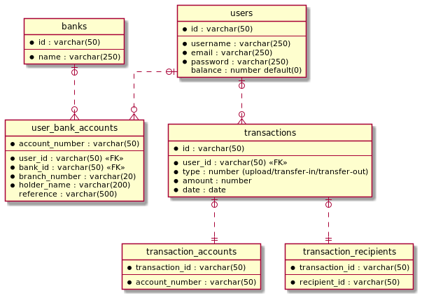

# Flash
This application is a simulation of a wallet application which allows users to upload money to the
application's account and send to other people inside the application. 

## Story

The API contains the following API stories as a sample of
sending money application:

1. Login (username or email/password)
   1. The application will check if
     the input is in email format then, will search by email.
     Otherwise, will search by username.
   1. If the user is exists, input password will be encrypted.
   1. Encrypted password will be matched with saved one.
   1. If the password is matched, a JWT token will
   be sent having: user_id.
1. Connect bank (mock)
   1. Take data from user.
   1. Verify user bank account.
   1. If the user is verified, then the system will
      save the account data.
1. Upload money to Flash (daily limit 10k, weekly limit 50k)
   1. Check daily and weekly limits of upload transactions
   1. Send request to the selected bank account 
      to withdraw money.
   1. When the bank transaction is succeeded,
      add `upload` transaction to the user.   
   1. Add the amount to user's balance.
1. View balance
1. Send money (daily limit 10k, weekly limit 50k)
   1. Check balance
   1. Check daily and weekly limits of transfer-out transactions.
   1. When all checks are ok, add `send` transaction.
   1. The balance will be affected as following:
      1. Subtract the amount from the user balance.
      1. Add the amount to the recipient user balance.
1. View current exchange rate

The database structure is depicted as the following diagram:

## Run code

To run the code type `make run`

## Build code

To generate executable file `make build`

## Run docker

`make docker-up`

## Initiate db

To re/create tables run `make sql-init`

## Answers to questions
1. What would you add to your solution if you had more time?
   - I would add many things for example:
      - HTTP client to call exchange rate API
      - More unit tests
      - Refresh token
      - CI/CD automated build on repository
      - Stored procedures as an alternative for transactions
      - Chan for transactions to synchronize balance.
   
2. What is the best approach you found to structuring your apps ? Please give an
   example of the folder outline and discuss pros and cons of this structure.
   - The first thing is to not set a concrete struct as a parameter instead I should use interfaces
   as a contract.
   - For folder organization there is no standard way to organize them, but we have best practises
   which is: https://github.com/golang-standards/project-layout

3. What was the most useful feature added to the latest version of your chosen
   language? Please include a snippet of code that shows how you've used it (if
   applicable).
   - For new added features in language there is an important ones:
     - Embedded files
     - Generics (which is in beta and expected to be released in v1.18)
   - VoltDB is NewSQL in-memory database which is considered the fastest database IMHO.
   
4. How would you track down a performance issue in production? Have you ever had
   to do this?
   - Yes, first I revise the intended code and suspicious methods and make benchmarks 
     to make to check if the problem is solved
   - Other thing I did not use in Golang is profiling, but I used profiler in C# in the past to 
   find bottlenecks in the code.

5. How would you monitor and trace issues in a distributed systems environment?
   - Logging and use debugging when possible.
